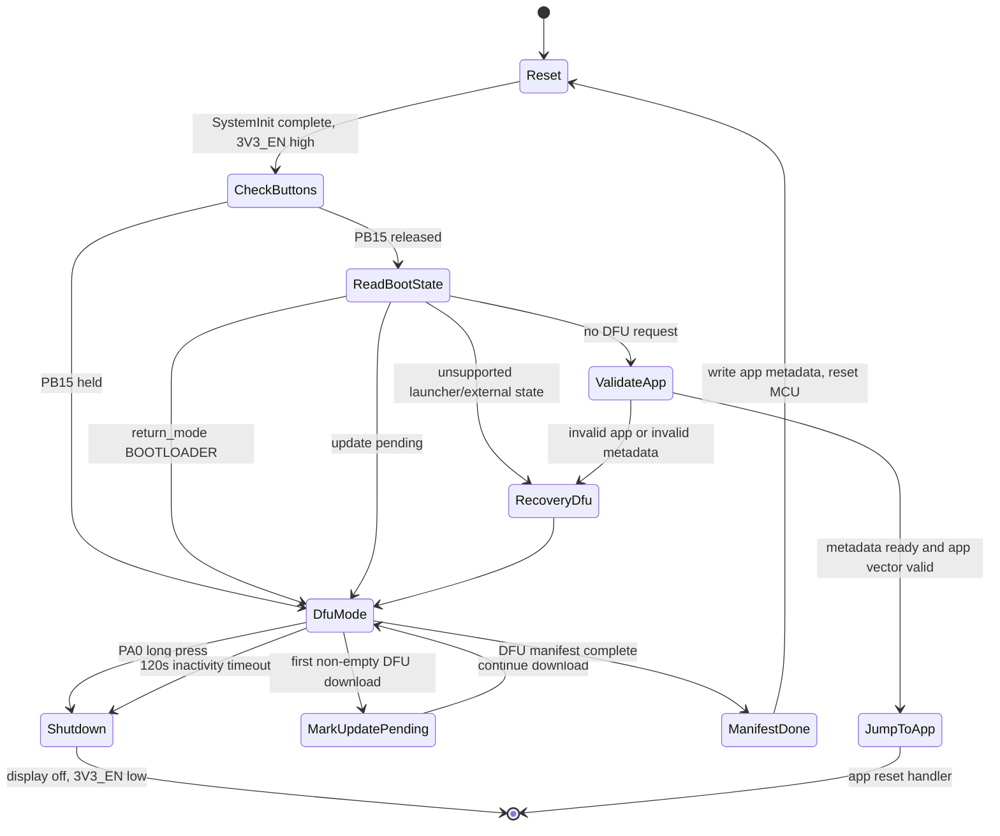

# USB DFU Bootloader Design

This document describes the Leta STM32F103 USB DFU bootloader implemented under `bootloader/`.

The design follows the useful reset/state behavior from the AK app launcher design, but removes the launcher and external W25Q app-slot model. Leta has one active application in internal STM32 flash. DFU writes that active app directly.

## Main Concept

The bootloader is a small fixed image at the start of internal flash. On every reset it:

1. Powers and initializes only the hardware needed for the boot decision.
2. Checks the DFU entry button and shared boot-state page.
3. Validates the active internal app.
4. Jumps to the app, or enters USB DFU recovery/update mode.

There is no launcher menu and no external app storage in this design.

```text
Power on / Reset
    |
    v
Bootloader starts from internal flash
    |
    v
Initialize power control and buttons
    |
    v
Check Left Down button, then shared boot state
    |
    +-- DFU requested? ---- yes ---> USB DFU mode
    |
    v
Validate active internal app
    |
    +-- valid? ----------- yes ---> Jump to app at 0x08007000
    |
    v
Recovery USB DFU mode
```

Primary requirements:

- Bootloader lives at `0x08000000`.
- Bootloader flash region is limited to `0x08000000..0x08005FFF`.
- Shared boot-state metadata page lives at `0x08006000..0x08006FFF`.
- Application starts at `0x08007000`.
- Application update uses TinyUSB DFU over STM32F103 USB FS.
- Bootloader holds the board power rail on by driving `3V3_EN` high on `PB0`.
- Long-pressing Right Down, schematic `Button 1` on `PA0`, shuts the bootloader down only while in DFU mode by releasing `3V3_EN`.
- DFU mode releases `3V3_EN` after an inactivity timeout so the board can shut down if left in bootloader mode.
- DFU entry button is Left Down, schematic net `SW2`, MCU pin `PB15`, active low.

## Memory Layout

```text
Internal STM32 Flash
0x08000000  +---------------------------+
            | Bootloader                | 24 KiB
0x08006000  +---------------------------+
            | Shared boot-state         | 4 KiB
            | persistent metadata page  |
0x08007000  +---------------------------+
            | Active application        | 100 KiB
0x08020000  +---------------------------+
```

| Region | Address range | Size | Owner |
| --- | --- | --- | --- |
| Bootloader | `0x08000000..0x08005FFF` | 24 KiB | USB DFU bootloader |
| Shared boot-state metadata | `0x08006000..0x08006FFF` | 4 KiB | Persistent state shared by bootloader and app |
| Application | `0x08007000..0x0801FFFF` | 100 KiB | Leta app image |

The bootloader linker script defines:

- `FLASH_BASE_ADDR = 0x08000000`
- `BOOTLOADER_FLASH_BYTES = 0x6000`

The page from `0x08006000` through `0x08006FFF` is intentionally outside both linker regions. It is reserved for persistent boot/update metadata and must survive application DFU updates.

The application linker script defaults:

- `APP_START_ADDR = 0x08007000`
- `SOC_FLASH_BYTES = 0x20000`

The app build also defines `VECT_TAB_OFFSET=0x7000`, so the app relocates its vector table to `FLASH_BASE + 0x7000`.

## Shared Boot State

The shared page is normal internal flash. It is reserved so the bootloader and app can exchange persistent boot/update commands without mixing writable metadata into code pages.

This design keeps the AK-style rule:

```text
Host or app requests boot action
    |
    v
Shared boot state is written
    |
    v
MCU resets
    |
    v
Bootloader reads shared boot state
    |
    v
Bootloader handles request, clears handled state, then continues
```

For Leta, the bootloader uses the AK-compatible `sys_boot_t` layout from `app_data.h`:

```c
typedef struct {
    firmware_header_t current_fw_boot_header;
    firmware_header_t current_fw_app_header;
    firmware_header_t update_fw_boot_header;
    firmware_header_t update_fw_app_header;
    firmware_boot_cmd_t fw_boot_cmd;
    firmware_boot_cmd_t fw_app_cmd;
    uint8_t return_mode;
    uint8_t reserved[3];
} sys_boot_t;
```

The useful boot-state commands are:

| State | Meaning | Boot behavior |
| --- | --- | --- |
| erased/invalid | No trusted metadata | Fall back to button and app-vector checks |
| `return_mode = SYS_BOOT_RETURN_BOOTLOADER` | App requested bootloader on next reset | Clear request and enter USB DFU |
| `update_pending` | App update was requested or interrupted | Enter USB DFU recovery/update mode |
| `update_complete` | DFU finished and app should be verified | Verify app, clear/update state, then jump or recover |

The exact C layout can remain AK-compatible if `ak-flesh` expects it, but Leta should interpret it without launcher-specific behavior:

- `SYS_BOOT_RETURN_BOOTLOADER` means enter USB DFU mode.
- `SYS_BOOT_RETURN_LAUNCHER` is unsupported and should be treated as USB DFU recovery or cleared as invalid.
- `SYS_BOOT_CONTAINER_EXTERNAL_FLASH` is unsupported because there is no W25Q app launcher.
- `SYS_BOOT_CONTAINER_DIRECTLY` maps to direct internal app update through USB DFU.

`psk` or other metadata magic must never be the only condition for jumping to the app.

Use this rule:

```text
metadata valid = boot state looks intentional
vector valid   = app entry point looks executable
image valid    = optional checksum/CRC matches accepted image
```

The implementation currently checks the app vector table and the AK metadata marker. The first non-empty DFU download block marks `fw_app_cmd.cmd = SYS_BOOT_CMD_UPDATE_REQ` before app flash is erased or programmed, so an interrupted update returns to DFU recovery. DFU manifest writes `current_fw_app_header.psk = FIRMWARE_PSK`, stores the observed app length when known, sets `fw_app_cmd.cmd = SYS_BOOT_CMD_UPDATE_NONE`, and clears `return_mode`.

Checksum is stored as `0` for TinyUSB DFU updates because USB DFU does not currently provide the AK `ak-flesh` checksum header.

Handled boot-state requests must be cleared after use. Otherwise the board can get stuck re-entering DFU on every reset.

## Build Outputs

Bootloader build:

```bash
make -C bootloader
```

Generated files:

| File | Purpose |
| --- | --- |
| `bootloader/build_LETA_BOOTLOADER/LETA_BOOTLOADER.axf` | ELF image |
| `bootloader/build_LETA_BOOTLOADER/LETA_BOOTLOADER.bin` | raw binary for flashing |
| `bootloader/build_LETA_BOOTLOADER/LETA_BOOTLOADER.hex` | Intel HEX image |
| `bootloader/build_LETA_BOOTLOADER/LETA_BOOTLOADER.map` | linker map |
| `bootloader/build_LETA_BOOTLOADER/LETA_BOOTLOADER.asm` | disassembly |

Program bootloader with ST-Link:

```bash
make flash-bootloader-stlink
```

This writes the bootloader binary at `0x08000000`.

Program application over DFU:

```bash
make flash
```

This builds the application and runs:

```bash
dfu-util -d 0309:2001 -a 0 -D application/build_OLED_WATCH/OLED_WATCH.bin
```

If `ak-flesh` is used as the host update tool later, it should target the same active internal app region:

```bash
ak-flesh /dev/ttyUSB0 application.bin 0x08007000 internal
```

External app-slot commands such as `... 0x00080000 external` are launcher/W25Q behavior and are not part of Leta's DFU bootloader.

## Source Layout

| Path | Role |
| --- | --- |
| `bootloader/sources/application/main.c` | boot decision, app jump, DFU flash callbacks |
| `bootloader/sources/application/tusb_config.h` | TinyUSB configuration |
| `bootloader/sources/application/usb_descriptors.c` | USB and DFU descriptors |
| `bootloader/sources/platform/io_cfg.c` | board hardware-unit helpers for power, buttons, OLED SPI transport, etc. |
| `bootloader/sources/platform/io_cfg.h` | bootloader board pin/API declarations |
| `bootloader/sources/driver/button/` | debounced button polling driver copied from the application |
| `bootloader/sources/driver/sh1106/` | SH1106 framebuffer/text driver for bootloader status UI |
| `bootloader/sources/device/core/STM32F103RBT6.ld` | bootloader linker script |
| `bootloader/sources/device/core/stm32f1xx.h` | STM32F1 compatibility wrapper for TinyUSB |
| `bootloader/sources/tinyusb/` | vendored TinyUSB stack |
| `bootloader/sources/device/STM32F10x_StdPeriph_Driver/` | local StdPeriph copy |

## Startup Flow

At reset, the startup assembly initializes `.data`, clears `.bss`, calls `SystemInit()`, then calls `main()`.

Bootloader `main()` performs:

1. Drive `3V3_EN` high on `PB0` to keep the AP2112K 3.3 V regulator enabled.
2. Configure Left Down button `PB15` and Right Down button `PA0` through the copied button driver with a 10 ms polling unit, matching the application.
3. If Left Down is pressed, enter USB DFU immediately.
4. Read shared boot-state metadata.
5. If boot state requests DFU, clear the handled request and enter USB DFU.
6. If boot state says update is pending or recovery is needed, enter USB DFU.
7. If the application vector table looks valid, jump to app.
8. Otherwise enter USB DFU recovery mode.

Pseudo-flow:

```text
reset
  -> SystemInit()
  -> power_pin_init(), power_pin_on()
  -> button_init(PB15 active low, 10 ms), button_init(PA0 active high, 10 ms)
  -> if PB15 pressed
       dfu_mode()
  -> read shared boot state
  -> if boot_state.return_mode == SYS_BOOT_RETURN_BOOTLOADER
       clear handled request
       dfu_mode()
  -> if boot_state.update_pending
       dfu_mode()
  -> if app_is_valid()
       jump_to_app()
  -> else
       dfu_mode()
```

Unsupported AK launcher states such as `SYS_BOOT_RETURN_LAUNCHER` and `SYS_BOOT_CONTAINER_EXTERNAL_FLASH` are treated as DFU recovery paths. The bootloader clears handled return modes before entering DFU so the board does not get stuck in the same request forever.

## State Machine

The bootloader code implements these states with `boot_state_t`:

| Code state | Role |
| --- | --- |
| `BOOT_STATE_CHECK_BUTTONS` | assert `3V3_EN`, initialize buttons, and check PB15 DFU entry |
| `BOOT_STATE_READ_BOOT_STATE` | read `sys_boot_t` and decide app/DFU/recovery |
| `BOOT_STATE_DFU` | run TinyUSB DFU task loop |
| `BOOT_STATE_JUMP_APP` | jump to app vector table at `0x08007000` |
| `BOOT_STATE_RECOVERY` | route invalid/unsupported states into DFU |
| `BOOT_STATE_SHUTDOWN` | turn OLED off and release `3V3_EN` |
| `BOOT_STATE_RESET` | reset after DFU manifest |



Important transitions:

| From | Event / condition | To | Action |
| --- | --- | --- | --- |
| `CheckButtons` | `PB15` held low | `DfuMode` | enter USB DFU immediately |
| `ReadBootState` | `return_mode == SYS_BOOT_RETURN_BOOTLOADER` | `DfuMode` | clear return mode, enter USB DFU |
| `ReadBootState` | `fw_app_cmd.cmd == SYS_BOOT_CMD_UPDATE_REQ` | `DfuMode` or `RecoveryDfu` | recover/update active app |
| `ValidateApp` | app metadata ready and vector valid | `JumpToApp` | set VTOR/MSP and branch to app |
| `DfuMode` | first non-empty download block | `MarkUpdatePending` | write `SYS_BOOT_CMD_UPDATE_REQ` before app flash erase/program |
| `DfuMode` | manifest complete | `ManifestDone` | write `FIRMWARE_PSK`, `UPDATE_NONE`, observed app length |
| `DfuMode` | `PA0` long press or idle timeout | `Shutdown` | turn OLED off and release `3V3_EN` |

## Power Control And Shutdown

The board power regulator enable net is `3V3_EN`, connected to `PB0`. The bootloader uses `power_pin_init()` and `power_pin_on()` immediately in `main()`.

This is required because the wake/power button can start the board, but firmware must keep `3V3_EN` asserted after the button is released. Without this, the board can lose 3.3 V power before USB DFU or app jump is usable.

DFU mode uses a 120 second inactivity timeout. The timeout starts when DFU mode is entered and is refreshed by DFU download, upload, manifest, abort, and detach callbacks. If the timeout expires, the bootloader turns the SH1106 display off and calls `power_pin_off()`, releasing `3V3_EN`.

Long-pressing Right Down while in DFU mode also calls `power_pin_off()`. This path ignores DFU state and app validity.

## DFU Entry Button

Left Down is schematic net `SW2`, MCU pin `PB15`.

Configuration:

- GPIO port: `GPIOB`
- Pin: `PB15`
- Mode: input pull-up
- Active level: low

The bootloader enters DFU mode when this button is held low at reset.

## Application Validity Check

The bootloader reads the first two words of the app vector table:

| Word | Address | Meaning |
| --- | --- | --- |
| word 0 | `0x08007000` | initial stack pointer |
| word 1 | `0x08007004` | reset handler |

The app is considered vector-valid when:

- initial stack pointer is inside SRAM: `0x20000000..0x20005000`
- reset handler points inside application flash: `0x08007000..0x08020000`
- reset handler address has bit 0 set, meaning Thumb code

The current implementation has no cryptographic signature. TinyUSB DFU updates do not provide the AK checksum header, so the bootloader uses vector validity plus `FIRMWARE_PSK` metadata for normal boot. If `ak-flesh` is added as a real transport later, the bootloader should also verify the stored app length and checksum.

## Jump To Application

Before jumping, the bootloader:

1. Disables interrupts.
2. Stops SysTick.
3. Clears NVIC enable and pending registers.
4. Sets `SCB->VTOR` to `0x08007000`.
5. Loads MSP from the app vector table.
6. Branches to the app reset handler.

The app is responsible for its own clock/peripheral initialization after entry.

The app must not jump directly back into the bootloader. To request DFU mode, the app should write shared boot-state `return_mode = DFU` and call `NVIC_SystemReset()`. Reset returns clocks, interrupts, SysTick, stack, and peripherals to a known state before the bootloader runs.

## USB DFU Mode

DFU mode initializes:

- SH1106 OLED status text: `USB DFU Mode`.
- SysTick at 1 ms for TinyUSB timing.
- USB peripheral clock.
- TinyUSB device stack on root hub port `0`.

The main DFU loop continuously calls:

```c
tud_task();
```

After DFU manifest completes, the bootloader updates the shared `sys_boot_t` app metadata, waits briefly, and resets the MCU with `NVIC_SystemReset()`.

The OLED status path uses the bootloader SH1106 driver in `bootloader/sources/driver/sh1106/`. The driver follows the framebuffer/text/update style used by the AK Adafruit OLED driver, but keeps Leta's SPI transport through `bootloader/sources/platform/io_cfg.c` for OLED init, reset, DC control, and SPI byte writes.

USB identity:

| Field | Value |
| --- | --- |
| VID | `0x0309` |
| PID | `0x2001` |
| Manufacturer | `Leta` |
| Product | `USB DFU Bootloader` |
| Serial | none (`iSerialNumber = 0`) |
| DFU alt setting | reuses product string |

DFU attributes:

- download supported
- upload supported
- manifestation tolerant

Transfer size:

```c
CFG_TUD_DFU_XFER_BUFSIZE = 1024
```

This matches the STM32F103 medium-density flash page size.

## Flash Programming

DFU block address calculation:

```text
address = APP_START_ADDR + block_num * CFG_TUD_DFU_XFER_BUFSIZE
```

The bootloader only accepts operations in:

```text
0x08007000 <= address < 0x08020000
```

For non-zero length writes, the whole transfer must fit before `0x08020000`.

Erase/program behavior:

1. Unlock flash if needed.
2. If the destination address is page-aligned, erase that 1 KiB page.
3. Program incoming bytes as 16-bit halfwords.
4. If the transfer length is odd, pad the final halfword with `0xFF` in the high byte.
5. Verify each programmed halfword by reading it back.
6. Lock flash again.
7. Report DFU status to TinyUSB.

DFU error mapping:

| Failure | DFU status |
| --- | --- |
| address outside application range | `DFU_STATUS_ERR_ADDRESS` |
| page erase failure | `DFU_STATUS_ERR_ERASE` |
| program/readback failure | `DFU_STATUS_ERR_PROG` |

DFU must never erase or write:

- bootloader region `0x08000000..0x08005FFF`
- shared boot-state page `0x08006000..0x08006FFF`

## Flash Upload

DFU upload reads from the same protected application region. Requests outside the valid application address range return length `0`.

This allows reading back the current app image with:

```bash
dfu-util -d 0309:2001 -a 0 -U app-readback.bin
```

## USB Hardware Assumptions

USB FS uses STM32F103 pins:

| USB signal | MCU pin |
| --- | --- |
| `USB_DM` | `PA11` |
| `USB_DP` | `PA12` |

The schematic has an external 1.5 k pull-up from D+ to 3.3 V. STM32F103 does not have an internal D+ pull-up, so this external pull-up is required for enumeration.

The bootloader uses TinyUSB's STM32 FSDEV backend:

```text
bootloader/sources/tinyusb/src/portable/st/stm32_fsdev/
```

TinyUSB is built with:

- `CFG_TUSB_MCU=OPT_MCU_STM32F1`
- `STM32F103xB`
- `CFG_TUD_ENABLED=1`
- `CFG_TUD_DFU=1`
- `CFG_TUH_ENABLED=0`

## Removed Launcher/W25Q Behavior

The AK reference design supports a launcher menu and external W25Q app slots. Leta intentionally removes that layer.

Not part of this bootloader:

- W25Q external app table
- external app slots at `0x00080000`, `0x000A0000`, etc.
- app icons
- UP/DOWN launcher navigation at reset
- copying selected apps from external flash into internal flash
- `return_mode = LAUNCHER`

Kept from the AK-style design:

- reserved shared internal flash page at `0x08006000`
- reset-based app-to-bootloader requests
- clear handled boot-state requests after reading them
- validate app before jumping
- recovery update mode when app is invalid

## Current Limitations

- No cryptographic signature or checksum.
- TinyUSB DFU does not yet receive the AK `ak-flesh` checksum header.
- No image version metadata.
- No rollback slot.
- No protection against losing power during erase/program.
- DFU idle timeout powers the board off instead of jumping to the app.
- VID/PID are project-local values and should be replaced before production.
- DFU writes assume 1 KiB block/page alignment from the host transfer size.

## Verification Checklist

After bootloader changes:

```bash
make -C bootloader clean all
```

Expected checks:

- `.isr_vector` is linked at `0x08000000`.
- bootloader flash use is below `0x6000`.
- `make -n flash-bootloader-stlink` writes to `0x08000000`.

After application changes:

```bash
make -C application clean all
```

Expected checks:

- `.isr_vector` is linked at `0x08007000`.
- `VECT_TAB_OFFSET` remains `0x7000`.

## Related Docs

- `docs/hardware-description.md`
- `hardware/Sheet1.pdf`
- `/workspace-256GB/ak-base-kit-fw-launcher/docs/stm32_w25q_app_launcher_design.md`
